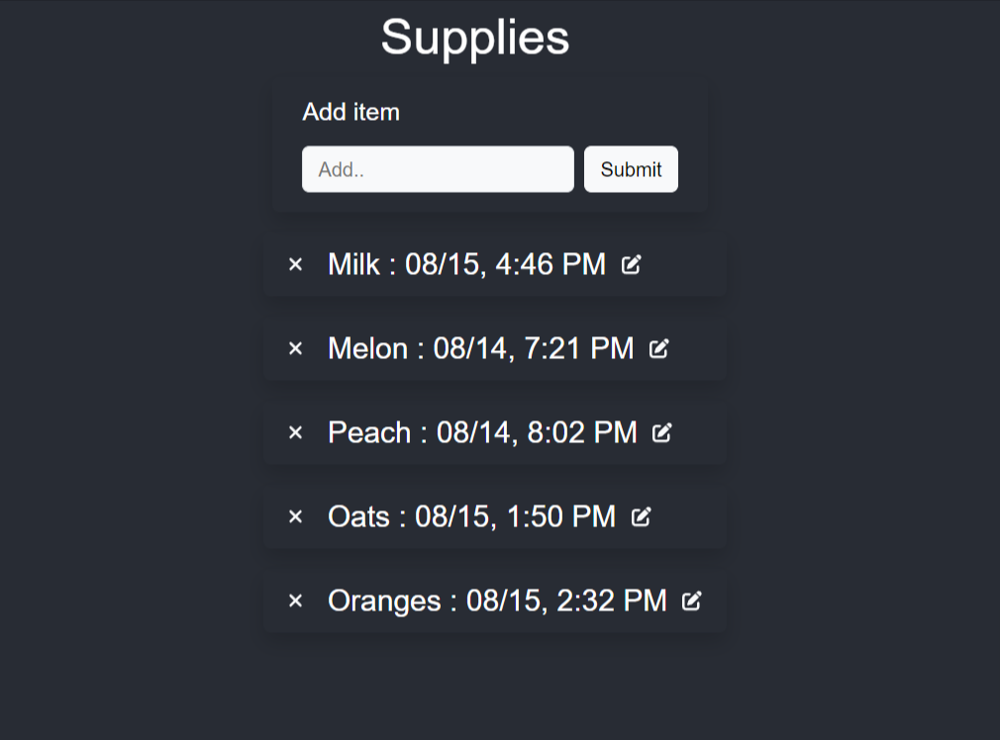

# Tracker App

This is a simple web application built with React.js and Flask for tracking anything such as groceries.

## Features

- Add, edit, and delete events.
- Display events with their descriptions and timestamps.
- User-friendly interface with Bootstrap and Font Awesome icons.

## Getting Started

### Prerequisites

- Node.js (v14.0.0 or higher) and npm (v6.0.0 or higher)
- Python (Flask)
- PostgreSQL

### Installation

Follow these steps to get the app up and running:

1. Clone the repository:
   ```shell
   git clone https://github.com/your-username/tracker-app.git
   cd tracker-app

## 2. Install Frontend Dependencies and Start the React Development Server

#### Navigate to the frontend directory:

  - cd frontend

#### Install frontend dependencies:

  - npm install

#### Start the React development server:
   
  - npm start
    
## 3. Install Backend Dependencies and Start the Flask Server

#### Navigate to the backend directory:

  - cd backend

#### Install backend dependencies:

  - pip install -r requirements.txt

#### Start the Flask server:

  - flask run

## Open the App in Your Browser

Open your web browser and navigate to [http://localhost:3000](http://localhost:3000) to see the app in action.

# Technologies Used

- Frontend: React.js, Bootstrap, Font Awesome
- Backend: Flask, SQLAlchemy
- Database: PostgreSQL
- Styling: CSS

# Screenshot




  
